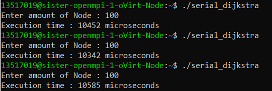
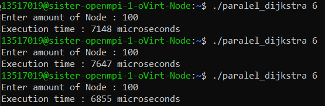
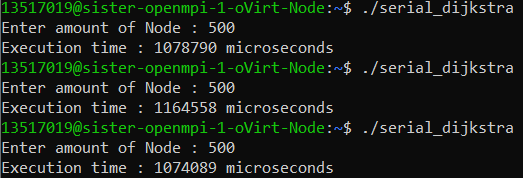
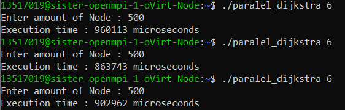
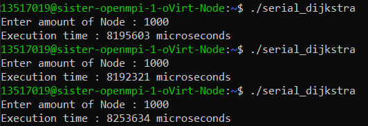
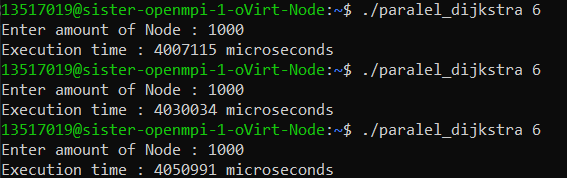
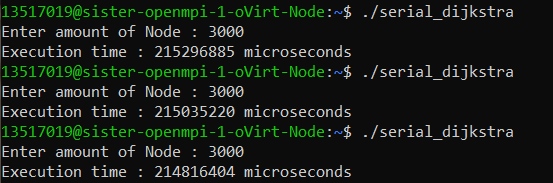
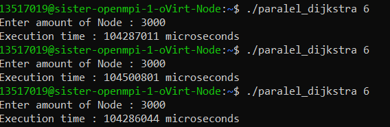

# Petunjuk Penggunaan Program
Untuk menjalankan program serial, gunakan perintah ‘make serial’.  
Untuk menjalankan program paralel dengan jumlah thread 6, gunakan perintah ‘make paralel’.  
Setelah menjalankan perintah make, masukan jumlah node  yang diinginkan.

# Pembagian Tugas
| Nama | NIM | Pembagian Tugas |
| ------ | ------ | ------ |
| Lydia Astrella Wiguna | 13517019 | Inisiasi, Implementasi program paralel berdasarkan program serial, Dokumen |
| Karina Iswara | 13517031 | Implementasi program paralel berdasarkan program serial, Dokumen |

# Deskripsi Solusi Paralel
Setelah pengguna memasukkan jumlah Node yang diinginkan untuk dicari jarak terdekatnya, graf diinisialisasi. Lalu dengan menggunakan pragma omp parallel for sebanyak jumlah thread (6). Dengan iterasi for yang dibagi-bagi ke 6 buah thread. Algoritma dijkstra yang dijalankan setiap iterasi merupakan dijkstra untuk mendapatkan jarak terdekat dari suatu node. Jadi jumlah iterasi dijkstra sebanyak jumlah node yang ditentukan pengguna.  Lalu hasil dari dijkstra yang berupa array jarak terdekat dari suatu node ke semua node yang ada disusun menjadi matriks yang berisi jarak terdekat dari semua node ke semua node yang ada pada graf. Setelah matriks terbentuk, matriks di-print ke file output.

## Analisis Solusi
Pada solusi paralel yang kami lakukan, waktu eksekusi yang dibutuhkan seharusnya menjadi lebih cepat jika dibandingkan dengan program serial karena pencarian jarak terdekat dari setiap sumber node pada solusi paralel dilakukan pada beberapa thread secara bersamaan sedangkan solusi serial mengeksekusi jarak terdekat dari semua sumber node dalam 1 proses (dalam solusi paralel beban kerja terbagi menjadi sejumlah thread).  Namun tentu saja dapat terjadi kasus dimana solusi paralel tidak lebih cepat dibandingkan solusi serial (bergantung pada jumlah thread dan node). Hal ini disebabkan oleh overhead pembuatan thread dan penghacuran thread.

Seharusnya terdapat kemungkinan masih ada solusi yang memberikan kinerja lebih baik. Sebagai contohnya membuat paralel pada pencarian jarak terdekat dari satu titik (node) ke titik lainnya. Yakni mengimplementasikan algoritma paralel langsung dalam fungsi dijkstra yang terdapat dalam algoritma kami.

# Jumlah Thread
Thread yang digunakan berjumlah 6 karena untuk proses komputasi, menggunakan jumlah thread lebih dari jumlah host/core tidak menambah performa. Sedangkan untuk jumlah thread di bawah 6 memakan waktu eksekusi lebih lama dari 6 thread.

# Pengukuran Kinerja
### N = 100
Serial :  

Paralel :  

### N = 500
Serial :  

Paralel :  

### N = 1000
Serial :  

Paralel :  

### N = 3000
Serial :  

Paralel :  

# Analisis Perbandingan Kinerja
Dari hasil pengukuran kinerja pada serial dan paralel dengan N = 100, 500, 1000, dan 3000, dapat dilihat bahwa waktu pengukuran hasil dari algoritma Dijkstra Paralel memiliki waktu performa yang lebih kecil (lebih cepat). Hal ini disebabkan oleh beban untuk menjalankan algoritma Dijkstra pada algoritma Dijkstra Paralel dibagi menjadi 6, yakni sejumlah thread sedangkan pada algoritma Dijkstra Serial semua beban tersebut ditangani sendiri.
